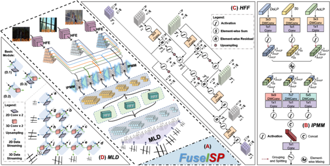
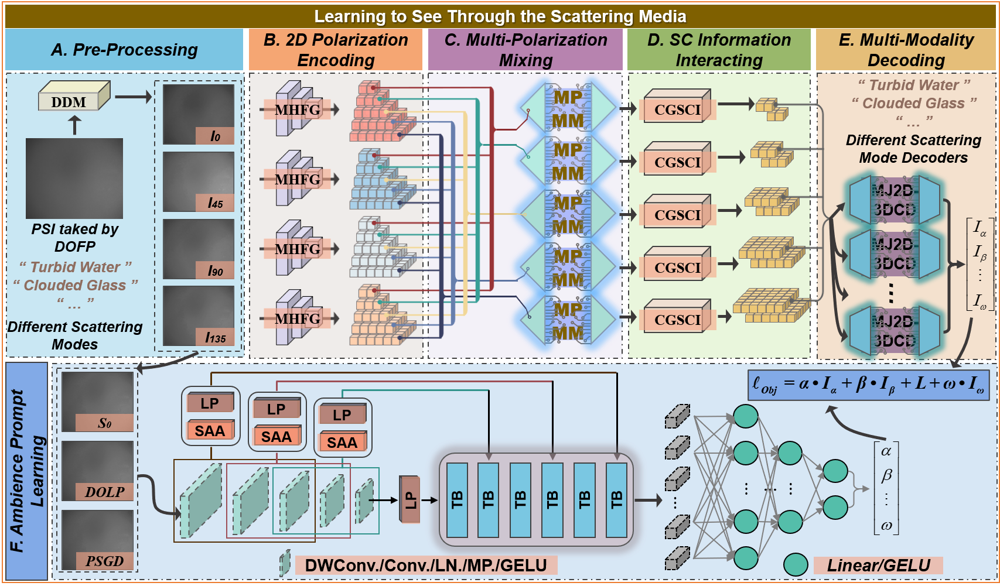
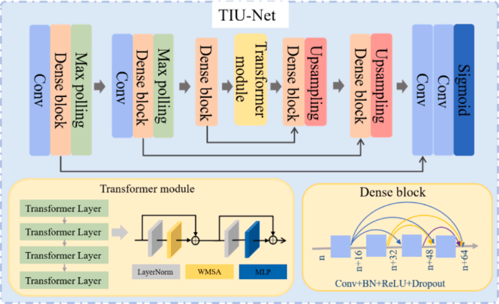
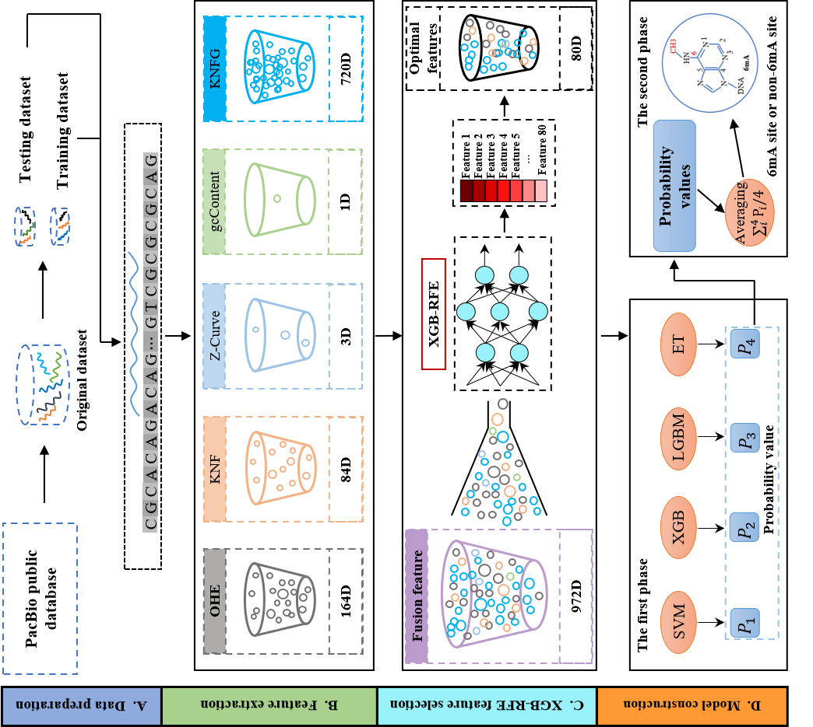
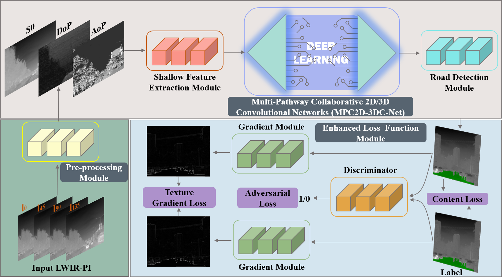
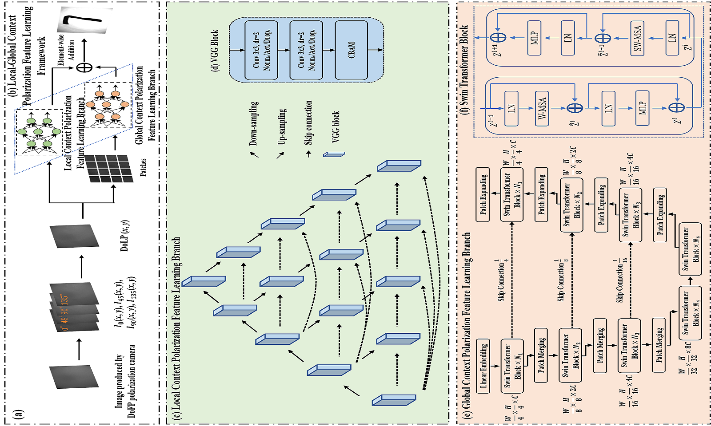








Currently I am alive. My name is Xueqiang Fan (樊学强), I'm a 4th-year PHD student at the School of Computer Science, Information and Communication Engineering, Hefei University of Technology, supervised by Prof. [Zhongyi Guo](https://scholar.google.com/citations?hl=zh-CN&user=pUjROEwAAAAJ). 

My curriculum vitae (**CV**) can be downloaded here ([**English**](https://xueqiangf.github.io/Xue-QiangFAN-EN-CV.pdf) & [**Chinese**](https://xueqiangf.github.io/Xue-QiangFAN-CV.pdf)).

<!-- 🌟 I'm currently actively seeking for Ph.D., Research Assistant, or internship positions related to Graph Learning. I'm also open to any possible discussions or collaborate opportunities. If you're interested in working with me, don't hesitate to drop me an email!  -->

<!-- My curriculum vitae (**CV**) can be downloaded [here](https://github.com/GuanchengWan/guanchengWan.github.io/raw/master/docs/GuanchengWan_cv.pdf).  -->

# 🔎 Research 
"All things are interconnected, this is the essence of nature." 

 🌟 Now, my primary research interest is to design effective visual understanding models for visual systems, involving <strong>Artificial Intelligence, Pattern Recognition, and Polarization Vision</strong>. 

Specifically, my recent endeavor is on <strong>Polarization Scattering Imaging</strong>, aiming to reconstruct objects hidden inside scattering  media (e.g., turbid water and haze) from speckle pattern-carrying polarization information. I am also conducting research on <strong>Scene Confusing-Discovery</strong>, using Polarization Information to mine the <strong>Camouflaged/Confusing/Special</strong> yet meaningful object/region in the scene. These objects are very common in daily life scenes but can confuse the vision systems due to their inherently special properties. I am pursuing exploring <strong>useful cues based on Polarization and effective methods for accurate detection</strong>. 

Additionally, my early work focused on <strong>Computational Biology, specifically identifying biochemical properties and functions of Proteins, RNA, and DNA</strong>, which are the cornerstone of providing more detailed information for Protein Drug Design and Molecular Diagnostics. 

 

# 🔥 News

<ul>
  <li><em>2024.11.06:</em> 🎈🎈🎈I was honored with <strong>National Scholarship</strong>.</li>
  <li><em>2024.09.23:</em> I serve as a reviewer for <strong>BioData Mining</strong>.</li>
  <li><em>2024.08.27:</em> ✨✨✨ Our paper entitled "Transformer-based improved U-net for high-performance underwater polarization imaging" was accepted by <strong>Optics & Laser Technology</strong> (中科院2区 TOP, IF=4.60).</li>
  <li><em>2024.06.24:</em> ✨✨✨ One paper as the <strong>First Author</strong> entitled "Ense-i6mA: Identification of DNA N6-methyladenine Sites Using XGB-RFE Feature Selection and Ensemble Machine Learning" was accepted by <strong>IEEE/ACM Trans. Comput. Biol. Bioinf.</strong> ( CCF B , 中科院3区, IF=4.5). <strong>The work was accepted outright after close to two years of review with no major or minor revisions.</strong></li>
   <li><em>2024.03.27:</em> 🚀🚀🚀 One paper as the <strong>First Author</strong> entitled "LMPC2D3DCNet: Infrared Polarization-Empowered Full-Time Road Detection via Lightweight Multi-Pathway Collaborative 2D/3D Convolutional Networks" was accepted by <strong>IEEE Trans. Intell. Transp. Syst.</strong> (CCF B, 中科院1区 TOP, IF=8.5).</li>
  <li><em>2024.03.14:</em> ✨✨✨ One paper as the <strong>First Author</strong> entitled "Improved Polarization Scattering Imaging Using Local-Global Context Polarization Feature Learning Framework" was accepted by <strong>Opt. Lasers Eng.</strong> (中科院2区, IF=4.6).</li>
  <li><em>2023.12.12:</em> ✨✨✨ Our paper entitled "Dynamic polarization fusion network (DPFN) for imaging in different scattering systems" was accepted by <strong>Opt. Express</strong> (中科院2区 TOP, IF=3.80).</li>
  <li><em>2023.10.16:</em> ✨✨✨ One paper as the <strong>First Author</strong> entitled "TSMPN-PSI: High-performance polarization scattering imaging based on three-stage multi-pipeline networks" was accepted by <strong>Opt. Express</strong> (中科院2区 TOP, IF=3.80).</li>
  <li><em>2023.02.01:</em> ✨✨✨ One paper as the <strong>First Author</strong> entitled "I-DNAN6mA: Accurate Identification of DNA N6-Methyladenine Sites Using the Base-Pairing Map and Deep Learning" was accepted by <strong>J. Chem. Inf. Model.</strong> (中科院2区 TOP, IF=6.16)</li>
  <li><em>2022.12.16:</em> ✨✨✨ Our paper entitled "Self-attention module in multi-scale improved U-net (SAM-MIU-net) motivating high-performance polarization scattering imaging" was accepted by <strong>Opt. Express</strong> (中科院2区 TOP, IF=3.83).</li>
  <li><em>2022.05.10:</em> 🎈🎈🎈 Congratulations, Xue-Qiang Fan successfully graduated from Zhejiang University of Technology, School of Information Engineering with the M.S. degree in Control Science and Engineering. From July 2019 to May 2022, he has got <strong>2</strong> SCI-indexed papers and <strong>1</strong> paper under review as the <strong>First Author</strong>, and <strong>2</strong> papers accepted as the Co-Author. Besides, he has received <strong>8</strong> patents, of which <strong>4</strong> have been authorized, and <strong>4</strong> software publications have been authorized, and won <strong>1 First</strong> prize and <strong>1 Second</strong> prize in an academic competition for university students. After that, he will continue to Hefei University of Technology to pursue his Ph.D. degree. </li>
  <li><em>2021.08.29:</em> ✨✨✨ One paper as the <strong>First Author</strong> entitled "Improved protein relative solvent accessibility prediction using deep multi-view feature learning framework" was accepted by <strong>Anal. Biochem.</strong> (中科院3区, IF=3.65)</li>
</ul>

 
# 📃 Publications 

**&dagger; Equal Contribution   *Corresponding authors**   

##  📝 Manuscripts

<dl>
    
Manuscript FuseISP 2024

	<dt></dt>
	<dd><strong>Joint intensity-spectral polarization hierarchical fusion guided efficient transparent object detection</strong></dd> 
 	<dd><strong>Under Review</strong></dd>
</dl>

<dl>
    
Manuscript LSTSM 2024

	<dt></dt>
	<dd><strong>LSTSM (Learning to See Through the Scattering Media): Towards a general-purpose framework for multi-modality polarization scattering imaging</strong></dd> 
 	<dd><strong>Under Review</strong></dd>
</dl>

<dl>
    
Manuscript Meta-DUNET-UPI 2023

	<dt></dt>
	<dd><strong>Meta-DUNET-UPI: Improving polarization imaging through highly turbid underwater using a deformable network and meta-learning</strong></dd> 
 	<dd><strong>Under Review</strong></dd>
</dl>

## 📝 Published

<dl>
    
Opt. Laser Technol. 2025

	<dt></dt>
	<dd><a href="10.1016/j.optlastec.2024.111664"><strong>Transformer-based improved U-net for high-performance underwater polarization imaging</strong> 
	 </a></dd>
	<dd>Bing Lin, Weiyun Chen, <strong>Xueqiang Fan</strong>, Peng Peng, Zhongyi Guo *</dd>
 	<dd><strong>Optics & Laser Technology 181 (2025) 111664. [中科院2区 TOP|JCR 1区|IF4.6]</strong></dd>
    <dd><a href="https://xueqiangf.github.io/doc/20240827 (Opt. Laser Technol.) TIU-Net.pdf" target="_blank">PDF</a></dd>
</dl>

<dl>
    
IEEE TCBB 2024

	<dt> </dt>
	<dd><a href="https://doi.org/10.1109/TCBB.2024.3421228"><strong>Ense-i6mA: Identification of DNA N6-methyladenine Sites Using XGB-RFE Feature Selection and Ensemble Machine Learning</strong> 
	 </a></dd>
	<dd><strong>Xueqiang Fan</strong>, Bing Lin, Jun Hu*, Zhongyi Guo*</dd>
 	<dd><strong>IEEE/ACM Trans. Comput. Biol. Bioinf., 2024. [中科院3区 | CCF B|JCR 1区|IF4.5]</strong></dd>
    <dd><a href="https://xueqiangf.github.io/doc/20240625 (IEEE-ACM Trans. Comput. Biol. Bioinf.) Ense-i6mA.pdf" target="_blank">PDF</a> | <a href="https://github.com/XueqiangF/Ense-i6mA" target="_blank">Code</a></dd>
</dl>

<dl>
    
IEEE TITS 2024

	<dt></dt>
	<dd><a href="https://doi.org/10.1109/TITS.2024.3383405"><strong>Infrared Polarization-Empowered Full-Time Road Detection via Lightweight Multi-Pathway Collaborative 2D/3D Convolutional Networks</strong> 
	 </a></dd>
	<dd><strong>Xueqiang Fan</strong>, Bing Lin, Zhongyi Guo*</dd>
 	<dd><strong>IEEE Trans. Intell. Transp. Syst., 25(9), 12762-12775, 2024. [中科院1区 TOP | CCF B | JCR 1区 | IF8.5]</strong></dd>
    <dd><a href="https://xueqiangf.github.io/doc/2024 (IEEE Trans. Intell. Transp. Syst.) LMPC2D3DCNet.pdf" target="_blank">PDF</a> | <a href="https://github.com/XueqiangF/LMPC2D3DCNet" target="_blank">Code</a></dd>
</dl>

<dl>
    
Opt. Lasers Eng. 2024

	<dt></dt>
	<dd><a href="https://doi.org/10.1016/j.optlaseng.2024.108194"><strong>Improved Polarization Scattering Imaging Using Local-Global Context Polarization Feature Learning Framework</strong> 
	 </a></dd>
	<dd><strong>Xueqiang Fan</strong>, Weiyun Chen, Bing Lin, Peng Peng, Zhongyi Guo*</dd>
 	<dd><strong>Opt. Lasers Eng. 2024;178:108194. [中科院2区|JCR 1区|IF4.6]</strong></dd>
    <dd><a href="https://xueqiangf.github.io/doc/2024 (Opt. Lasers. Eng) PSI-LGCPFL.pdf" target="_blank">PDF</a></dd>
</dl>

- `Analytical Biochemistry 2020` [Identification of ligand-binding residues using protein sequence profile alignment and query-specific support vector machine model](https://doi.org/10.1016/j.ab.2020.113799),  Jun Hu *, Liang Rao,  **<strong>Xue-Qiang Fan</strong>**, Dong-Jun Yu *, Gui-Jun Zhang *, Analytical biochemistry, 2020, 604: 113799. [<strong>中科院3区 | JCR 2区 | IF3.65</strong>]  [**PDF**](https://xueqiangf.github.io/doc/2020 (Analytical Biochemistry ) I-LBR.pdf)  

# 🎡 Service
##  Journal Reviewer
- Reviewer for BioData Mining
  <!-- - Reviewer for Data-centric Machine Learning Research (DMLR) -->

 

# 🎖 Scholarships and Honors

- *2024.11* **Lei Jun Excellence Scholarship** (**<u>雷军卓越奖学金</u>**) **~100k** (The **<u>Highest</u>** Scholarship at Wuhan University, **<u>Top-4</u>** among All Undergraduates, Award Rate: 10/65000+ ~ **0.01%**)  *Wuhan University*

- *2023.09* **National Scholarship** **(<u>Twice</u>)** (**<u>国家奖学金</u>**) (Award Rate: <strong>0.2% nation-wide</strong>) *Ministry of Education, China* 

- *2022.09* **National Scholarship** (**<u>国家奖学金</u>**) (Award Rate: <strong>0.2% nation-wide</strong>) *Ministry of Education, China* 

- *2024.10* **Luojia Undergraduate Innovation Research Fund** (首批珞珈本科生研究基金) ~50k (4 Students department-wide)  *Wuhan University*

- *2024.06* **Lei Jun Computer Innovation and Development Fund** and  **Research Fund** (雷军创新发展基金、雷军研究基金) (3 Students department-wide)  *Wuhan University*

- *2024.06* <a href="https://scholarship2024.sensetime.com/cn/">**SenseTime Scholarship**</a> (商汤奖学金) ~20k (**25 Students nation-wide**) *SenseTime*

- *2024.04* <a href="https://mp.weixin.qq.com/s/zdx8hH8-g0FScgZvkYQRnw">**CS Pioneer**</a> (计科先锋年度人物) (10 Students department-wide)  *Wuhan University*

- *2023.10* **CCF (China Computer Federation) Elite Collegiate Award** (CCF优秀大学生) (102 Students nation-wide) *China Computer Federation*

- *2023.10* **Pacemaker to Merit Student** (三好学生标兵) (Award Rate: 60/65000+ ~ <strong>0.1%</strong>) *Wuhan University*

- *2022.09* **First Class Scholarship** (Award Rate: 5% school-wide) *Wuhan University* 
- *2022.09* **Excellent Student Cadre** (Award Rate: 924/65000+ ~ 1.5%) *Wuhan University*

 

# 📖 Educations
- *2021.09 - Now*, Undergraduate, School of Computer Science, Wuhan University, China

<dl></dl>

# Miscellaneous

